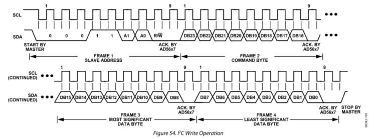
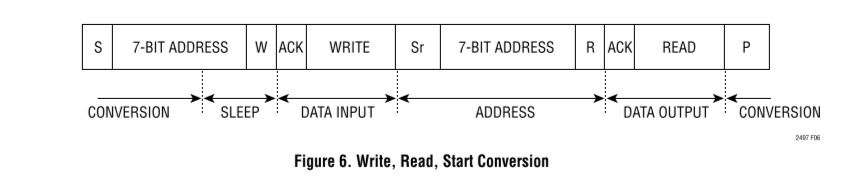
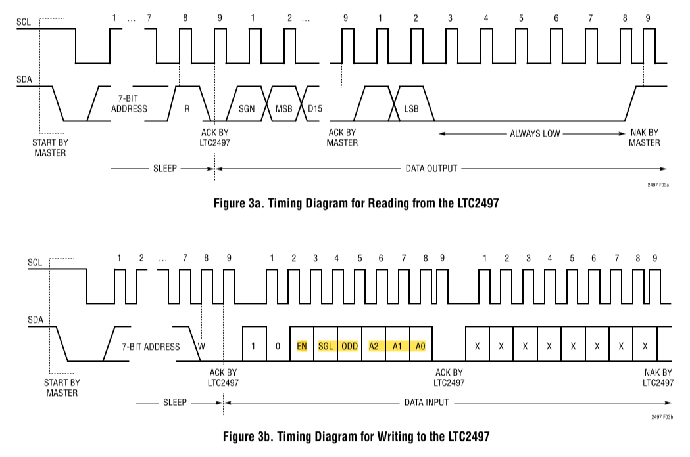
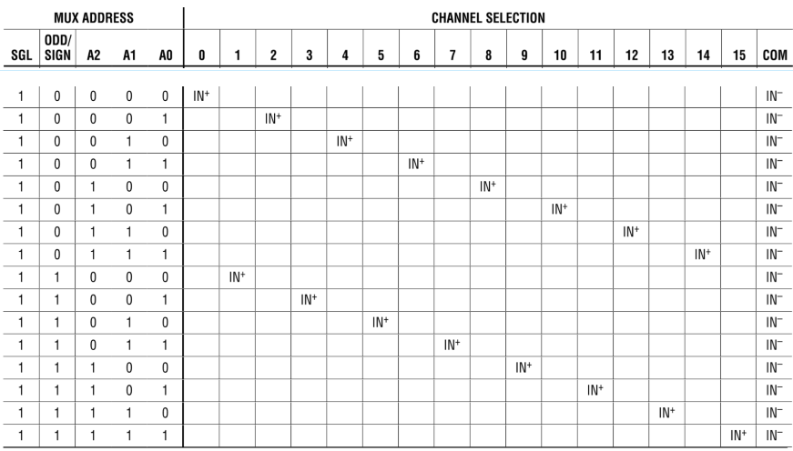

# Arduino para  controlar a DAC

## Funcionalidade do código de controlo da DAC

[I2C master DAC controller code](DAC_ADC_communication/DAC_ADC_communication.ino)

De momento o código desenvolvido deverá permitir a repetição de um determinado comando I2C através do pressionamento de um botão externo ao 
ao Arduino. 

A utilização de um novo comando deverá ser feita em código e seguida e um upload para o arduino. O inicio da comunicação I2C pelo master só é
autorizado após pressionar o botão.  

## Seleção das linhas IIC

| I2C SELECT1 	| I2C SELECT2 	| LINHA I2C SELECIONADA 	|
|-------------	|-------------	|:-----------------------:	|
| LOW         	| LOW         	|       SCL1/SDA1       	|
| LOW         	| HIGH        	|       SCL2/SDA2       	|
| HIGH        	| LOW         	|       SCL3/SDA3       	|
| HIGH        	| HIGH        	|       SCL4/SDA4       	|

Através da linha SCL/SDA

## DAC's controladas pelas linhas I2C
| Linhas IIC |           | DAC's controladas |             |
|------------|-----------|:-------------------:|-------------|
| SDA1/SCL1  | DAC_REF_1 | DAC_REF_2         | DAC_STAGE_5 |
| SDA2/SCL2  | DAC_REF_5 | DAC_REF_7         | DAC_STAGE_7 |
| SDA3/SCL3  | DAC_REF_3 | DAC_REF_4         | DAC_REF_8   |
| SDA4/SCL4  | DAC_REF_6 | DAC_STAGE_6       | DAC_STAGE_8 |

## Adress das DAC's

| ADDRESS 	|             	|             	|           	|             	|
|---------	|-------------	|-------------	|-----------	|-------------	|
| 0001100 	| DAC_STAGE_5 	|  DAC_REF_7  	| DAC_REF_3 	| DAC_STAGE_8 	|
| 0001110 	| DAC_REF_2   	|  DAC_REF_5  	| DAC_REF_8 	| DAC_STAGE_6 	|
| 0001111 	| DAC_REF_1   	| DAC_STAGE_7 	| DAC_REF_4 	| DAC_REF_6   	|

## Operação de escrita

### Comandos

DB23 -> Deve ser **zero** quando se escrever para a DAC

DB22 -> Seleciona se iremos fazer operação de multiplos bytes seguidos

| C2 	| C1 	| C0 	| Command                           	|
|----	|----	|----	|-----------------------------------	|
| 0  	| 0  	|  0 	| Write to input register           	|
| 0  	| 0  	|  1 	| Update DAC register n             	|
| 0  	| 1  	|  1 	| Write to and update DAC channel n 	|
| 1  	| 1  	| 0  	| LDAC register setup               	|
| 1  	| 1  	| 1  	| Internal reference setup (on/off) 	|

Temos ainda de escolher que DAC interna utilizar (temos 2 DAC's  dentro de cada):

| C2 	| C1 	| C0 	| Command 	|
|----	|----	|----	|---------	|
| 0  	| 0  	|  0 	| DAC A   	|
| 0  	| 0  	|  1 	| DAC B   	|
| 1  	| 1  	|  1 	| Ambas   	|

### Exemplos

Exemplifico como julgo métodos de escrever para a DAC_REF_1 referenciando a DAC A interna (V_REF_1):

00011110 0x 111 xxx xxxxxxxx xxxxxxx0 -> o modo default é com referencia interna desativada não deve ser necessário usar este comando

1ºMétodo:
* 00011110 00 110 xxx xxxxxxxx xxxxxx11 (x é o mesmo que dizer que é irrelevante ser 1 ou 0) -> fizemos setup do LDAC o que implica que o canal é atualizado automaticamente após escrevermos no imput register
* 00011110 00 000 000 11111111 11111111 (neste caso colocavamos 1.25V na saída)
* os comandos que se seguem são iguais ao anterior para writes futuros

2ºMétodo:
* 00011110 00 011 000 11111111 11111111 (colocámos 1.25V na saída) -> Write to and update DAC channel A

3ºMétodo:
* 00011110 00 000 000 11111111 11111111 -> write no input register
* 00011110 00 001 000 xxxxxxxx xxxxxxxx -> update no register da DAC interna

## Funcionalidade do código de controlo do ADC
# Arduino para controlar ADC 

Controlo através da linha SCL0/SDA0

| ADDRESS 	|             	|
|---------	|-------------	|
| 0010100 	| ADC pós-amp 	|
| 0110101 	| ADC pré-amp   |

## Comandos para iniciar conversão nos canais:

### Exemplo

Exemplo de uma leitura nova canal 0 do ADC pós-amp:

 * 00101000 10110000 -> write
 * 00101001 ->read

